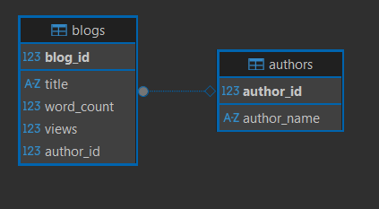
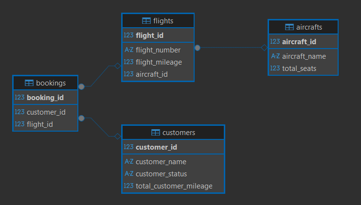

# Enterprise-Java-Development-3.02

Este repositorio contiene las soluciones para el ejercicio de normalización de bases de datos y consultas SQL.

## Estructura del Repositorio

- **`blogDB/`**: Contiene el script DDL para las tablas normalizadas del blog.
- **`airlineDB/`**: Contiene los scripts DDL y de consultas SQL para la base de datos de la aerolínea.

---

### Base de Datos de Blogs

Se normalizaron los datos para evitar redundancia y se crearon dos tablas: `Authors` y `Blogs`.
Puedes encontrar el script DDL en `blogDB/ddl.sql`.

---

### Base de Datos de Aerolíneas

Se normalizaron los datos en cuatro tablas: `Customers`, `Aircrafts`, `Flights`, y `Bookings`.
- **`ddl.sql`**: Contiene la definición de las tablas.
- **`queries.sql`**: Contiene todas las consultas SQL solicitadas en el ejercicio.

